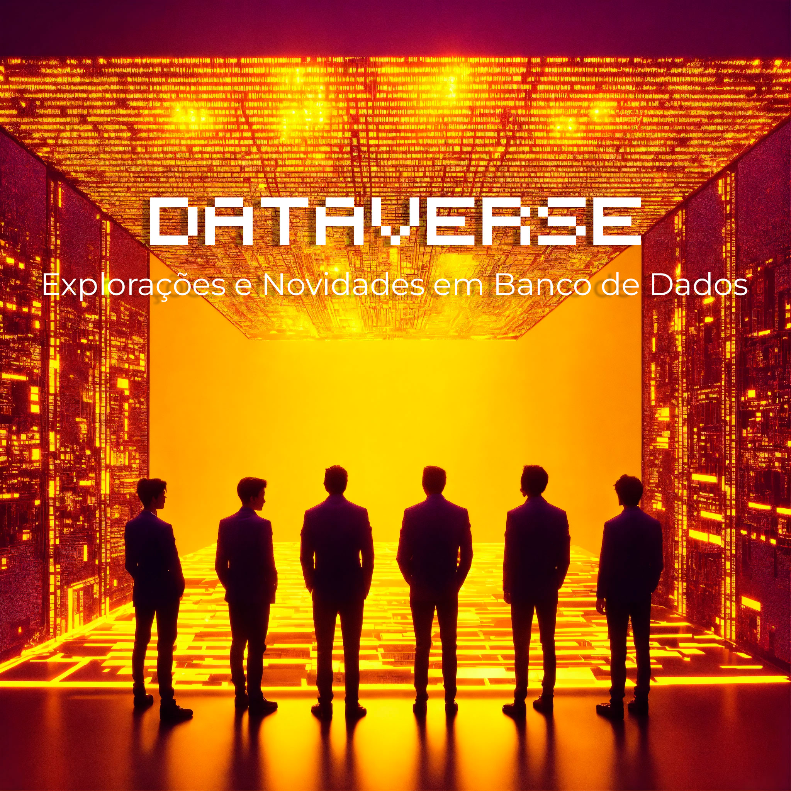

    Preview do podcast

    <audio src="Audio/Podcast-Editado/Podcast-Editado.MP3" controls title="Podcast editado"></audio>

# Projeto Podcast Gerado por I.A.s

Projeto com o objetivo de gerar um podcast utilizando ferramentas de IA através de prompts mais trabalhado.

Utilizer uma esteira de prompts para gerar cada etapa do processo criativo.

## 💻 Tecnologias utilizadas no projeto

- [ChatGPT](https://chat.openai.com/) 
- [Lexica](https://lexica.art/)
- [ElevenLabs](https://beta.elevenlabs.io/)
- [Capcut](https://www.capcut.com/pt-br/)

## ✨ Como foi feito ?

- Roteiro gerado via chatgpt
- Audio gerado pela elevenLabs
- Midjourney Para gerar capas
- Capcut para tratar aúdio e adicionar sons de fundo

## 👨‍💻 Autor

    
&nbsp&nbsp&nbspGustavo Carvalho 
    &nbsp&nbsp&nbsp
    <a 
        href="https://github.com/gustavoc-dev">
        GitHub
    </a>
    &nbsp;|&nbsp;
    <a 
        href="https://www.linkedin.com/in/gustavo-carvalho-desenvolvedor/">
        LinkedIn
    </a>
    &nbsp;|&nbsp;
    <a 
        href="https://www.instagram.com/gustavoc.dev/">
        Instagram
    </a>
    &nbsp;|&nbsp;

  

